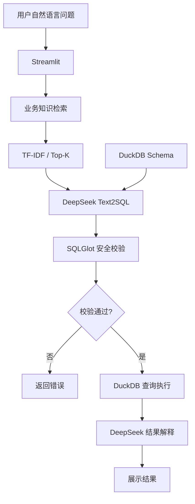

# AI Data Agent｜智能数据查询与分析平台

基于 RAG、Text2SQL 和大语言模型构建的智能数据查询原型，
支持用户通过自然语言完成数据查询、指标计算和结果分析。

## 1. 项目背景

在企业数据分析场景中，业务人员通常需要依赖数据分析师完成数据查询，存在重复性取数需求较多、指标口径不统一、数据资产检索效率较低等问题。
本项目基于上述业务场景，设计并实现一个自然语言数据分析Agent，探索将业务知识检索、Text2SQL、SQL安全校验与结果解释整合为完整的数据查询流程。
项目重点关注三个问题：
1. 业务口径一致性：如何将指标定义和数据字典引入SQL生成过程。
2. 查询安全性：如何对大模型生成的SQL进行结构化校验和访问控制。
3. 结果可验证性：如何通过标准SQL和自动化评测验证查询结果。
项目使用合成业务数据，不涉及真实企业数据。

## 2. 核心功能

| 模块 | 实现方式 | 主要作用 |
|---|---|---|
| 自然语言交互 | Streamlit | 接收中文业务查询，展示分析结果 |
| 业务知识检索 | TF-IDF+Top-K | 检索相关指标定义和数据字典 |
| Text2SQL | DeepSeek+Schema+业务知识 | 生成符合业务口径的SQL |
| SQL 安全校验 | SQLGlot+表白名单+DuckDB EXPLAIN | 拦截不符合规则的SQL |
| 查询执行 | DuckDB | 执行通过校验的查询 |
| 结果解释 | DeepSeek | 根据实际查询结果生成中文解释 |
| 自动化评测 | Gold SQL+结果对比 | 检验SQL执行结果是否正确 |

## 3. 技术架构



## 4. 技术栈

| 模块 | 技术 |
|------|------|
| 开发语言 | Python |
| 大语言模型 | DeepSeek API |
| 知识检索 | TF-IDF + Cosine Similarity |
| SQL 生成 | LLM + Schema + 业务知识 |
| SQL 校验 | SQLGlot + DuckDB EXPLAIN |
| 数据库 | DuckDB |
| Web 界面 | Streamlit |
| 自动化评测 | Python + Pandas |

## 5. 数据设计

项目使用四张模拟业务表：

| 数据表 | 说明 |
|--------|------|
| customers | 客户基本信息 |
| products | 产品信息 |
| transactions | 交易记录 |
| campaigns | 营销触达及转化记录 |

业务知识库包含：

- 数据字典：表结构、字段含义及关联关系
- 指标字典：指标定义、计算口径及过滤条件

例如：

**成功交易金额**

```sql
SELECT SUM(amount)
FROM transactions
WHERE status = 'SUCCESS';
```

通过检索指标定义，减少 SQL 语法正确但业务口径错误的问题。

## 6. 自动化评测

为验证Text2SQL的查询效果，项目构建了基于合成业务数据的测试集，并使用 Gold SQL 作为参考答案。

### SQL执行准确率

- 测试问题总数：15
- 可执行 SQL 评测问题：14
- 执行结果正确：14
- Execution Accuracy：100%（14/14）

评测方法：

1. 使用自然语言测试问题生成SQL。
2. 执行模型生成的SQL和人工编写的Gold SQL。
3. 对比两者的查询结果。
4. 查询结果一致则判定为正确。

结果对比允许忽略行顺序、列名差异及一定范围内的浮点数精度误差。
### SQL安全校验评测

为验证SQL安全校验机制，项目设计了10个测试用例，覆盖合法查询放行、危险操作拦截及非法表字段访问等场景。

**评测结果：10/10，通过率 100%。**

测试覆盖：

- 合法SELECT查询放行
- 合法WITH/CTE查询放行
- DELETE、UPDATE、DROP等危险操作拦截
- 非白名单数据表访问拦截
- 不存在字段的查询校验

安全校验采用SQLGlot AST解析、数据表白名单和DuckDB EXPLAIN组合实现。

当前测试仅覆盖预设用例，尚未进行大规模对抗测试。生产环境仍需配合数据库只读权限、查询资源限制和访问审计等措施。

### 业务知识检索评测

为验证业务知识检索模块的效果，项目设计了 8 个测试问题，覆盖交易金额、客户数量、营销转化率等业务指标。

检索模块采用 TF-IDF 计算文本相关性，每次返回 Top-3 知识片段。

**评测结果：Recall@3 = 100%（8/8）。**

在当前测试集中，全部 8 个问题的预期业务知识均成功进入检索结果前三名。

当前评测规模较小，主要验证已定义业务指标的检索效果。对于复杂语义表达、同义词变化和跨文档知识关联等场景，仍需进一步扩充测试集。

### 评测范围与局限性

- 测试基于合成业务数据，不涉及真实企业数据。
- 测试集规模较小，尚不足以证明模型在复杂业务场景中的泛化能力。
- Execution Accuracy衡量查询结果是否一致，不代表SQL语义在所有情况下均正确。
- 第15道问题涉及营销渠道转化率差异的原因分析，现有数据无法直接支持因果解释，因此未纳入SQL执行准确率统计。
- 当前结果仅代表本次测试集上的表现，不代表生产环境准确率。

## 7. 本地运行

### 1. 克隆项目

```bash
git clone https://github.com/daisymemo/ai-data-agent.git
cd ai-data-agent
```

### 2. 创建虚拟环境并安装依赖

```bash
python3 -m venv .venv
source .venv/bin/activate
pip install -r requirements.txt
```

### 3. 配置 API Key

在项目根目录创建 `.env` 文件：

```env
DEEPSEEK_API_KEY=your_deepseek_api_key
```

项目通过 `python-dotenv` 自动读取环境变量。

请勿将真实 API Key 提交到 GitHub。

### 4. 初始化模拟数据

```bash
python -m src.generate_data
python -m src.setup_database
```

### 5. 启动应用

```bash
streamlit run app.py
```

浏览器访问：

http://localhost:8501

## 8. 项目边界与后续优化

当前项目为基于固定工作流的 Data Agent 原型，
主要验证业务知识检索、SQL 生成、安全校验和结果解释的完整链路。

后续可进一步探索：

- 基于 Embedding 的语义检索
- SQL 错误反馈与自动修复
- 多轮对话和上下文管理
- 更大规模的业务问题评测
- 更完善的权限控制与查询资源限制
