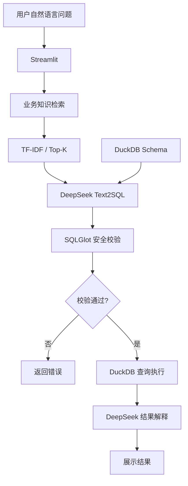

# AI Data Agent｜智能数据查询与分析平台

基于 RAG、Text2SQL 和大语言模型构建的智能数据查询原型，
支持用户通过自然语言完成数据查询、指标计算和结果分析。

## 1. 项目背景

在企业数据分析场景中，业务人员通常需要依赖数据分析师完成取数，
同时还面临指标口径不统一、数据资产难以检索、
重复性需求较多等问题。

本项目探索利用大语言模型和业务知识检索技术，
将自然语言问题转化为符合业务口径的 SQL，
并通过安全校验和结果解释，实现智能化数据查询。

项目使用模拟业务数据，不涉及真实企业数据。

## 2. 核心功能

- 自然语言查询：使用中文描述数据分析需求
- 业务知识检索：从指标字典和数据字典中检索相关知识
- Text2SQL：结合数据库 Schema 和业务知识生成 SQL
- SQL 安全校验：检查查询类型、表访问权限及 SQL 语义
- 数据查询执行：使用 DuckDB 执行经过校验的 SQL
- AI 结果解释：基于实际查询结果生成中文分析
- 可视化交互：通过 Streamlit 展示结果、SQL 和知识依据

## 3. 技术架构



## 4. 技术栈

| 模块 | 技术 |
|------|------|
| 开发语言 | Python |
| 大语言模型 | DeepSeek API |
| 知识检索 | TF-IDF + Cosine Similarity |
| SQL 生成 | LLM + Schema + 业务知识 |
| SQL 校验 | SQLGlot + DuckDB EXPLAIN |
| 数据库 | DuckDB |
| Web 界面 | Streamlit |
| 自动化评测 | Python + Pandas |

## 5. 数据设计

项目使用四张模拟业务表：

| 数据表 | 说明 |
|--------|------|
| customers | 客户基本信息 |
| products | 产品信息 |
| transactions | 交易记录 |
| campaigns | 营销触达及转化记录 |

业务知识库包含：

- 数据字典：表结构、字段含义及关联关系
- 指标字典：指标定义、计算口径及过滤条件

例如：

**成功交易金额**

```sql
SELECT SUM(amount)
FROM transactions
WHERE status = 'SUCCESS';
```

通过检索指标定义，减少 SQL 语法正确但业务口径错误的问题。

## 6. 自动化评测

项目建立了三类评测：

1. Execution Accuracy：比较生成 SQL 与标准 SQL 的执行结果
2. SQL Safety Evaluation：测试非法操作和越权查询的拦截情况
3. Retrieval Recall@3：检查目标指标知识是否进入检索结果 Top 3

已完成的测试结果：

| 指标 | 结果 |
|------|------|
| Execution Accuracy | 14/14（100%） |
| SQL Safety Evaluation | 待填写 |
| Retrieval Recall@3 | 待填写 |

注：上述结果仅代表当前自建小规模测试集上的表现，
不代表复杂生产场景下的整体准确率。

## 7. 本地运行

### 安装依赖

```bash
pip install -r requirements.txt
```

### 配置 API Key

```bash
export DEEPSEEK_API_KEY="your_api_key"
```

### 初始化数据库

```bash
python -m src.generate_data
python -m src.setup_database
```

### 启动应用

```bash
streamlit run app.py
```

## 8. 项目边界与后续优化

当前项目为基于固定工作流的 Data Agent 原型，
主要验证业务知识检索、SQL 生成、安全校验和结果解释的完整链路。

后续可进一步探索：

- 基于 Embedding 的语义检索
- SQL 错误反馈与自动修复
- 多轮对话和上下文管理
- 更大规模的业务问题评测
- 更完善的权限控制与查询资源限制