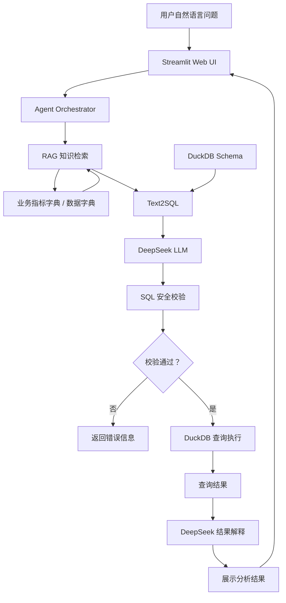

# AI Data Agent 系统架构

```mermaid
flowchart TD
    A["用户自然语言问题"] --> B["Streamlit Web UI"]
    B --> C["Agent Orchestrator"]

    C --> D["RAG 知识检索"]
    D --> E["业务指标字典 / 数据字典"]
    E --> D

    D --> F["Text2SQL"]
    G["DuckDB Schema"] --> F
    F --> H["DeepSeek LLM"]

    H --> I["SQL 安全校验"]
    I --> J{"校验通过？"}

    J -- 否 --> K["返回错误信息"]
    J -- 是 --> L["DuckDB 查询执行"]

    L --> M["查询结果"]
    M --> N["DeepSeek 结果解释"]
    N --> O["展示分析结果"]

    O --> B
```